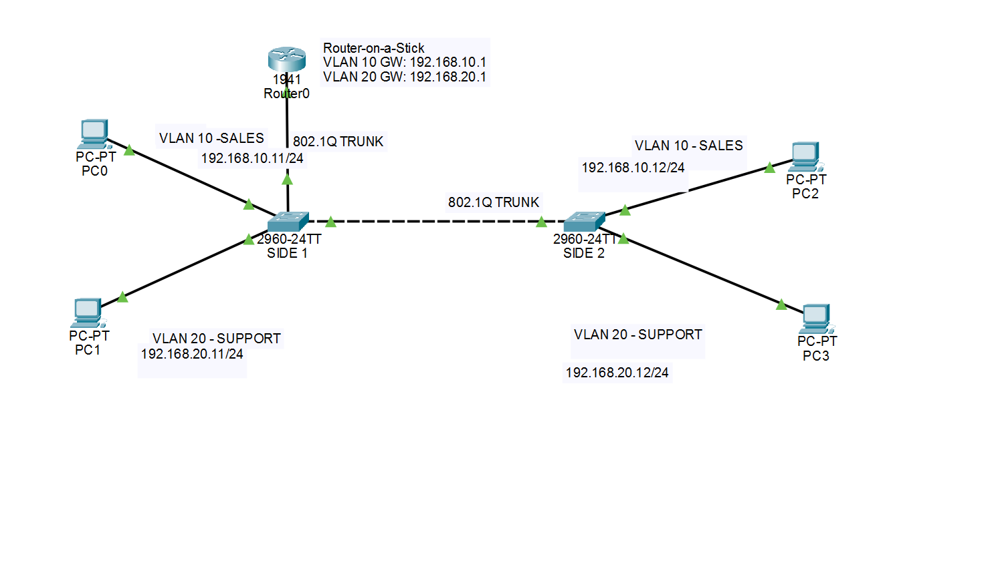

# inter-vlan-routing
Inter-VLAN routing using router-on-a-stick, 802.1Q trunks and connectivity verification in Cisco Packet Tracer.
# Inter-VLAN Routing — Router-on-a-Stick

## Overview

This lab extends my VLAN segmentation and trunking project by enabling communication between the SALES and SUPPORT networks using router-on-a-stick.

A Cisco 1941 router provides a default gateway for each VLAN through subinterfaces, with an 802.1Q trunk carrying both VLANs over a single physical connection.

## Topology



**Devices:** 1 Cisco 1941 router, 2 Cisco 2960 switches and 4 PCs.

## IP Addressing

| Device | VLAN | IP Address | Default Gateway |
|--------|------|------------|-----------------|
| PC0 | 10 — SALES | 192.168.10.11/24 | 192.168.10.1 |
| PC2 | 10 — SALES | 192.168.10.12/24 | 192.168.10.1 |
| PC1 | 20 — SUPPORT | 192.168.20.11/24 | 192.168.20.1 |
| PC3 | 20 — SUPPORT | 192.168.20.12/24 | 192.168.20.1 |

## Router Configuration

The physical interface is enabled without an IP address. Each subinterface uses an 802.1Q VLAN tag and serves as the gateway for its subnet.

```text
interface GigabitEthernet0/0
 no ip address
 no shutdown
!
interface GigabitEthernet0/0.10
 encapsulation dot1Q 10
 ip address 192.168.10.1 255.255.255.0
!
interface GigabitEthernet0/0.20
 encapsulation dot1Q 20
 ip address 192.168.20.1 255.255.255.0
```

## Switching

- VLAN 10 (SALES) and VLAN 20 (SUPPORT) span both switches.
- Access ports connect the PCs to their respective VLANs.
- An 802.1Q trunk connects the switches.
- A second 802.1Q trunk connects SIDE1 to the router.
- SIDE1 Gi0/1 and Gi0/2 were verified as operational trunks, with VLANs 10 and 20 active and forwarding.
- The trunk allowed VLAN list remains at its default setting; it is not restricted to VLANs 10 and 20.

## Verification

### Router interfaces

`show ip interface brief` confirmed that G0/0, G0/0.10 and G0/0.20 were all **up/up**.

### Routing table

`show ip route` confirmed both directly connected networks:

- `192.168.10.0/24` via G0/0.10
- `192.168.20.0/24` via G0/0.20

No static routes or dynamic routing protocol are required to route between these directly connected networks.

### Connectivity tests

The following pings from PC0 were successful:

| Destination | Purpose | Result |
|-------------|---------|--------|
| 192.168.10.1 | Reach the VLAN 10 gateway | Passed |
| 192.168.10.12 | Reach PC2 in the same VLAN | Passed |
| 192.168.20.12 | Reach PC3 in a different VLAN | Passed |

## Troubleshooting

During the initial configuration, the router's physical G0/0 interface was administratively down, preventing inter-VLAN communication.

I enabled the interface with `no shutdown`, verified the physical interface and subinterfaces were up/up, and repeated the connectivity tests successfully.

This highlighted the importance of checking interface status alongside VLAN tagging, trunk configuration and default gateways.

## Skills Demonstrated

- VLAN segmentation and access port configuration
- 802.1Q trunking
- Router subinterfaces and inter-VLAN routing
- IPv4 addressing and default gateways
- Interface and routing table verification
- ICMP connectivity testing and troubleshooting

## Lab File

[Download the Packet Tracer lab](inter-vlan-routing.pkt)

Open the file in Cisco Packet Tracer to inspect the configuration and repeat the tests.
